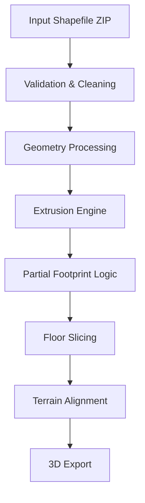

# geo3d-pipeline
# 🏗️ 3D Building Processing Pipeline 

---

## 📌 Overview

A **configurable, production-grade pipeline** for transforming **2D building footprints** into:

* 3D building geometries
* Floor-wise sliced models
* Support for non-uniform structures (setbacks / terraces)

Built entirely using open-source tools, serving as a lightweight alternative to proprietary platforms such as ArcGIS Pro and CityEngine.

---

## 🚀 Key Capabilities

* **Input Handling**

  * Supports zipped shapefiles (`.shp`, `.shx`, `.dbf`, `.prj`)
  * Automatic schema detection for height attributes

* **Geometry Processing**

  * Geometry validation and repair
  * Optional merge of overlapping polygons
  * Filtering of invalid / small geometries

* **3D Modeling**

  * Full footprint extrusion
  * Partial footprint extrusion (setback modeling)
  * Multi-level building representation

* **Floor Slicing**

  * True 3D slicing using mesh operations
  * Supports uniform and partial floors

* **Spatial Intelligence**

  * CRS normalization (auto reprojection)
  * Optional terrain alignment using DTM

* **Output**

  * Formats: `OBJ`, `GLB`
  * Full building + per-floor outputs

* **Configurability**

  * Fully driven via YAML
  * No code modification required

---

## 🧱 Architecture



---

## 📂 Project Structure

```bash
project/
├── config.yaml
├── pipeline.py
├── requirements.txt
└── data/
    └── Kishangarh_Building_Sample.zip
```

---

## ⚙️ Installation

* **Environment Setup**

  ```bash
  conda create -n geo3d python=3.10 -y
  conda activate geo3d
  ```

* **Dependency Installation**

  ```bash
  pip install -r requirements.txt
  ```

---

## ▶️ Execution

```bash
python pipeline.py --config config.yaml
```

---

## 🧾 Configuration (config.yaml)

### Input Configuration

```yaml
input:
  zip_path: "data/Kishangarh_Building_Sample.zip"
  height_fields: ["ELEVATION", "HEIGHT", "BLDG_HT"]
  crs_projected: 3857
```

### Processing Controls

```yaml
processing:
  merge_overlaps: false
  clean_geometry: true
  min_area: 1.0
```

### Extrusion Parameters

```yaml
extrusion:
  base_height_default: 9.0
  use_attribute_height: true
  upper_height: 6.0
  coverage_ratio: 0.25
  partial_method: "scale"
```

### Floor Slicing

```yaml
slicing:
  floor_height: 3.0
  export_per_floor: true
```

### Terrain Integration (Optional)

```yaml
terrain:
  enable: false
  dtm_path: ""
```

### Output Settings

```yaml
output:
  out_dir: "output"
  format: "obj"
  prefix: "building"
```

---

## 📤 Output Artifacts

* **Full Building Models**

  ```bash
  building_1_full.obj
  ```

* **Floor-wise Outputs**

  ```bash
  building_1_base_floor_1.obj
  building_1_upper_floor_1.obj
  ```

---

## 🧠 Core Concepts

* **Extrusion**

  * Conversion of 2D footprints into volumetric 3D geometry

* **Partial Footprint Modeling**

  * Supports real-world building setbacks and terraces

* **Floor Slicing**

  * Horizontal segmentation of 3D meshes into discrete levels

---

## ⚠️ Limitations

* Partial footprint derived using geometric approximation (centroid scaling)
* Shapefile input constraints (field naming, topology issues)
* No native GIS 3D formats (e.g., Multipatch)
* High-volume datasets require batching / parallelization
* Terrain alignment dependent on external DTM availability

---

## 🚀 Scaling & Enhancements

* **Performance**

  * Parallel processing (multiprocessing / Dask)
  * Tile-based spatial partitioning

* **Formats**

  * Extend to `glTF` / **3D Tiles** for streaming

* **Deployment**

  * Containerization using Docker
  * API exposure via FastAPI

* **Visualization**

  * Integration with CesiumJS / WebGL viewers

---

## 📈 Use Cases

* Urban digital twin platforms
* Smart city visualization
* Infrastructure planning systems
* Geospatial analytics pipelines

---

## 🧾 License

Open-source (customize based on your distribution model)

---

## 💡 Summary

A **modular, extensible, and production-ready pipeline** enabling:

* Transition from **2D GIS → 3D modeling**
* Automation of **building massing and floor segmentation**
* Foundation for **scalable geospatial digital twin systems**

---
